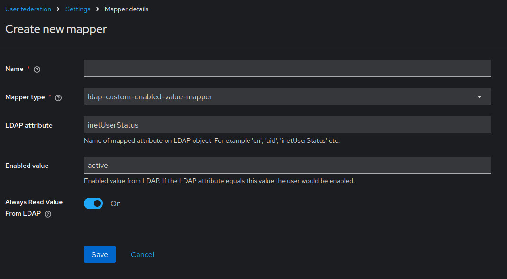

# Keycloak LDAP Custom Enabled Value Mapper

Very basic custom Keycloak LDAP mapper that allows you to specify a custom value for the LDAP attribute that enables a Keycloak user. The built-in User Attribute LDAP mapper allows you to map an enabled value, but the LDAP attribute value must be either true or false. With this custom mapper, you can specify any value you prefer. Note that the value will be parsed as a string and is case-insensitive.

# Installation

Download a release (*.jar file) that works with your Keycloak version from the list of release. Copy to the `provider/` path and restart your Keycloak.

# Configuration

Create a new mapper for your user federation, select ldap-custom-enabled-value-mapper.

Set the name of your LDAP attribute under `LDAP attribute` and specify the custom LDAP attribute value that will enable the user under `Enabled value`. When the user's LDAP attribute value matches the `Enabled value`, the user will be enabled. If it does not match, the user will remain disabled.

Example:

